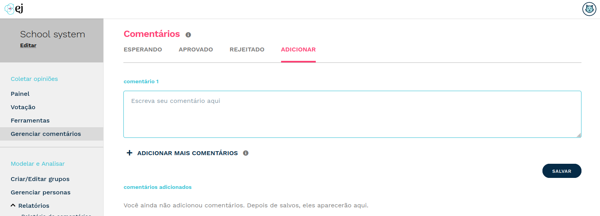

*********************************
Como gerenciar um comentário?
*********************************

Para gerenciar um comentário, você deve ser o criador da conversa. Dentro da página demonstrada pela figura 
abaixo, você poderá visualizar comentários que possuem 3 diferentes tipos de status:

* Esperando
* Aprovado
* Rejeitado

Além disso, haverá uma quarta opção, onde o usuário poderá realizar um novo comentário.
Veja abaixo a imagem que demonstra as opções:

   Tela para gerenciar comentários.

Todo novo comentário passará pelo processo de validação do criador da conversa, enquanto o
comentário não for validado, ficará com o status "Esperando". Uma vez aprovado, 
o comentário ficará disponível para votação.